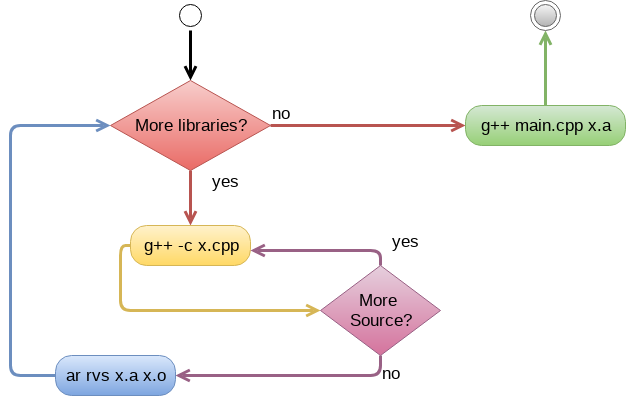
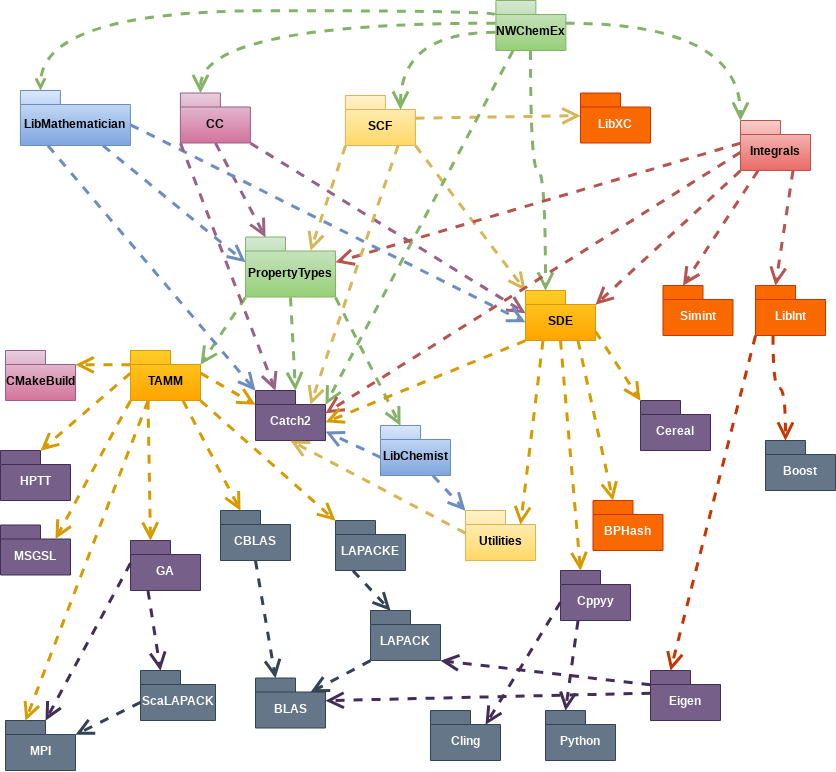

.. _motivations-label:

Motivations
===========

This page motivates why a package like CMakePP is needed.

Why CMake?
----------

Since CMakePP extends CMake, it makes sense to start with a motivation for why
one should even consider using CMake with their package. For that matter, why
even use a build system? After all the final compilation just looks something
like:

While it's true that the actual compilation amounts to little more than calling
the compiler on a mound of source files, archiving sets of the resulting objects
into libraries, and then linking the results together, what the above image
fails to capture is the complicated web of dependencies among those source files
as well as the myriad of compiler/linker options that are available for each of
these calls. These dependencies ultimately form a DAG (directed acyclic graph),
but figuring out that DAG and traversing it are not that simple. As an example
of a sort of worst-case scenario, consider the NWChemEx project's dependencies:

What all the dependencies are is unimportant, what's more important is the
realization that a typical package's dependency DAG is complicated and not
something you want to traverse/manipulate by hand. This is where build systems
come in.

.. sidebar:: On-The-Fly Build System

    .. image:: OnTheFly.png

Traditional build systems (think ``make``) are designed to simplify the process
of specifying a project's dependency DAG. The problem with most of these build
systems is that they are designed assuming a static software stack (recall that
the internet wasn't a thing so it was a lot harder to get new programs). Modern
development practices mean builds need to be a lot more fluid. It is now common
place for a build to support multiple configurations, optional dependencies,
cross compilation, and (shudder) multiple architectures. While it is possible to
make traditional build systems do this, it is far easier to generate the build
system on-the-fly. The programs that do this are sometimes called "meta build
systems". It is the CMakePP, philosophy that this distinction is a moot point
since for all practical purposes one can treat the fact that meta build systems
generate traditional build systems as an implementation detail. Hence we forgo
the "meta" distinction.

CMake falls into the category of modern/meta-build systems. Users of CMake
describe their package's configure, build, test, and install needs in the
CMake language. The CMake language is designed to make common build concepts,
like executables, libraries, and dependencies first-class citizens. Thanks to a
syntax resembling shell-scripting, CMake greatly simplifies writing dynamic
build systems that involve logic. Compared to its largest competitor, GNU's
Autotools, CMake's nicer syntax and cross-platform nature (as a disclaimer it is
fully possible to write cross-platform Autotools build systems, it's just a lot
harder than doing it in CMake) has caused CMake to become the *de facto* build
system for C/C++ projects.

What's Wrong With CMake?
------------------------

The last section makes CMake sound like the greatest thing since sliced bread,
so what's wrong with it? In our opinion CMake represents the best of the
available build systems; however, CMake is still a bad option. By this we mean
that CMake is loads better than trying to write one's own build system, or
attempting to use a more traditional build system; however, CMake still fails to
**natively** support several key build-system features:

* Automated and reliable building of dependencies
* Support for "virtual" dependencies (satisfied by many libraries ; think BLAS)
* Reliable dependency detection
* Automated packaging
* Dependency cacheing
* Continuous integration

In all fairness (and the reason "natively" is bolded) it is possible to do
everything on the above list using CMake (if it were not, then CMakePP wouldn't
be possible). The problem is that the mechanisms and patterns for doing so are
boilerplate heavy, poorly documented, and fragile. When you have a great idea
for an awesome C++ project the build system shouldn't slow you down. Adding to
the frustration is the fact that the CMake language feels quite antiquated
compared to scripting languages like Python. Notably the CMake language lacks
(native) support for:

* Objects
* Callbacks
* Lambdas
* Overloading
* Associative arrays
* Lists (that aren't super buggy because they're strings delimited by ``;``...)
* Serialization
* Intraspection

It is our opinion, that modern software packages now impose requirements on the
build system far beyond the original design points of CMake. There's at least
two ways forward: redesign the build system from the ground up, or add another
layer on top of CMake. Being blunt, the former is probably the way to go;
however, inertia on the part of the community makes this option infeasible
without the resources/market power of a company like Google or an intervention
by the compilers/languages themselves. Thus we're relegated to the latter
option.
