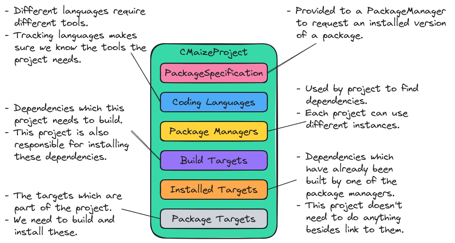

.. Copyright 2023 CMakePP
..
.. Licensed under the Apache License, Version 2.0 (the "License");
.. you may not use this file except in compliance with the License.
.. You may obtain a copy of the License at
..
.. http://www.apache.org/licenses/LICENSE-2.0
..
.. Unless required by applicable law or agreed to in writing, software
.. distributed under the License is distributed on an "AS IS" BASIS,
.. WITHOUT WARRANTIES OR CONDITIONS OF ANY KIND, either express or implied.
.. See the License for the specific language governing permissions and
.. limitations under the License.

.. _designing_cmaizes_cmaizeproject_component:

##########################################
Designing CMaize's CMaizeProject Component
##########################################

In :ref:`overview_of_cmaizes_design` we motivated the need for a
CMaizeProject component in order to track the state of the :term:`project`. This
page details the design process of the CMaizeProject component.

************************************
What is the CMaizeProject Component?
************************************

A :term:`build system` is written to direct a :term:`build tool` how to build
a :term:`project`. The CMaizeProject component is the part of CMaize
charged with representing the overall state of the :term:`project`. In practice,
a CMaizeProject will serve as a container for collecting the project's
configuration options, :term:`dependencies <dependency>`,
:term:`build targets <build target>`, and :term:`packaging <package>`
information.

*****************************************
Why Do We Need a CMaizeProject Component?
*****************************************

While CMake has a concept of a :term:`project`, CMake lacks the ability to
easily see the pieces of the :term:`project`. For example, at the time of
writing there is not a simple CMake function which returns a list of a
project's :term:`dependencies <dependency>`. Without a mechanism to query the
properties of a project, CMake relies on the user to resupply the same
information to a number of functions.

One of the main considerations for writing CMaize is
:ref:`minimizing the redundancy<minimize_redundancy>` found in typical
CMake-based :term:`build systems <build system>`. To this end, the CMaizeProject
component is designed to collect the project's properties into a single
source of truth. With access to a project's properties it is easier for CMaize
to automatically propagate the project's information to multiple CMake
functions.

**************************************
CMaizeProject Component Considerations
**************************************

In designing the CMaizeProject component we considered:

.. _cp_workspace:

workspace
   The :ref:`cmake_based_build_system` consideration means that the user API of
   CMaize will rely on functional-style programming. Under the hood, we will
   store the objects associated with the active project in a ``CMaizeProject``
   object. Thus many of the :ref:`user api<designing_cmaizes_user_api>`
   functions are implemented using a pattern of:

   1. Retrieve the active ``CMaizeProject``.
   2. Use the objects in the active ``CMaizeProject`` to complete a task.
   3. If necessary, update the objects in the active ``CMaizeProject``.
   4. Save the active ``CMaizeProject`` in such a manner that this process can
      be repeated.

   Subjected to such a workflow, the ``CMaizeProject`` object takes on a
   workspace-like role.

.. _cp_building:

building
   Following from :ref:`cp_workspace`, the CMaizeProject component must
   store the information necessary to build the project. This includes:

   - coding languages,
   - configure options,
   - compile options,
   - dependencies, and
   - build targets.

   Tracking the interdependency among the dependencies and targets will be the
   responsibility of CMaize's Target component
   (see :ref:`designing_cmaizes_target_component`). The CMaizeProject component
   simply must maintain a list of targets.

.. _cp_packaging:

packaging
   The :ref:`cp_building` consideration means that the CMaizeProject
   component will already contain most of the information necessary for
   automating the generation of packaging information (e.g. the CMake
   ``xxx-config.cmake`` files). The present consideration is that we should
   ensure that the CMaizeProject component has all of the information necessary
   to automate packaging.

   - After consideration :ref:`cp_building` the CMaizeProject component
     just needs metadata about the project in order to automate packaging.
     Additional needed metadata includes: the package name and the version.
   - Somewhat of a corollary, packaging the project requires being able to
     distinguish among :term:`build targets<build target>` which stem from
     dependencies and build targets which are part of the package since they may
     be (and often are) treated differently.

.. _cp_recursive:

recursive
   In :ref:`overview_of_cmaizes_design` we noted that the overall design of
   CMaize needed to account for the :ref:`recursive` consideration. For the
   CMaizeProject component this means being able to:

   - have multiple instances of a ``CMaizeProject``,
   - associate each ``CMaizeProject`` instance with a specific project,
   - store the ``CMaizeProject`` instances in a manner that facilitates
     retrieval given the active CMake project, and
   - access ``CMaizeProject`` instances from higher/lower levels of build system
     recursion.

*************************************
Design of the CMaizeProject Component
*************************************

.. _fig_cmaize_project:

   The design of the CMaizeProject component of CMaize.

:numref:`fig_cmaize_project` shows the design of the CMaizeProject component.
In keeping with object-oriented practices we introduce a class ``CMaizeProject``
to represent a project which uses CMaize as its build system. Together the
:ref:`cp_building` and the :ref:`cp_packaging` considerations establish the
state the ``CMaizeProject`` object must possess. The :ref:`cp_recursive`
consideration leads to the realization that the current project (in package
form) will in general be a dependency of one or more downstream projects. When
the downstream project needs to find the current
project, the downstream project will need the ability to uniquely distinguish
among package iterations (instances of a package that differ in configuration
and/or version). This requires tagging the package with some subset of a
``CMaizeProject`` object's state and to this end we introduce
the ``PackageSpecification`` class (full design discussion
:ref:`designing_package_specification`).

Keeping with :term:`DRY` we want each piece of state in the CMaizeProject
component to appear in only one place and thus one of the key design decisions
regarding the ``CMaizeProject`` and ``PackageSpecification`` classes is the
partitioning of the state between the classes. In CMaize-based build systems
we will rely on ``PackageManager`` objects for managing packages (see
:ref:`overview_of_cmaizes_design`). Briefly we envision ``PackageManager``
objects as being maps from a ``PackageSpecification`` object to the package. The
``PackageManager`` is an abstraction which hides the building and storage
details of the packages it manages, thus it needs to know which package
we want to build and what settings/options to build the package with.

Finally, because of the :ref:`cp_workspace` consideration, we opt to store most
``CMaizeProject`` state not in the ``PackageSpecification`` class, but as
targets. More specifically, modern CMake is target-based. We thus need a
mechanism to
retrieve the build system targets from within the implementation of CMaize's
user :term:`API`. By storing them in the ``CMaizeProject`` we can access the
targets by retrieving the ``CMaizeProject`` object for the project, and then
accessing the targets.

*******
Summary
*******

:ref:`cp_workspace`
   We have designed the ``CMaizeProject`` class in a way which stores the state
   of an entire project. ``CMaizeProject`` objects can be saved and loaded via
   global CMake variables in order to retrieve a project's state.

:ref:`cp_building`
   The ``CMaizeProject`` includes package managers which can be used to
   build/find dependencies, information about the coding languages of the
   project, and the literal build targets.

:ref:`cp_packaging`
   Each ``CMaizeProject`` object includes a ``PackageSpecification`` object.
   This object contains the information needed to retrieve the resulting package
   from a package manager. The total state of the ``CMaizeProject`` class
   (including its ``PackageSpecification`` member) is sufficient for auto-
   generating packaging files.

:ref:`cp_recursive`
    Each ``CMaizeProject`` object is associated with a single CMaize project.
    Multiple ``CMaizeProject`` objects may exist, thus allowing dependencies of
    a CMaize-based build system to also rely on CMaize.
