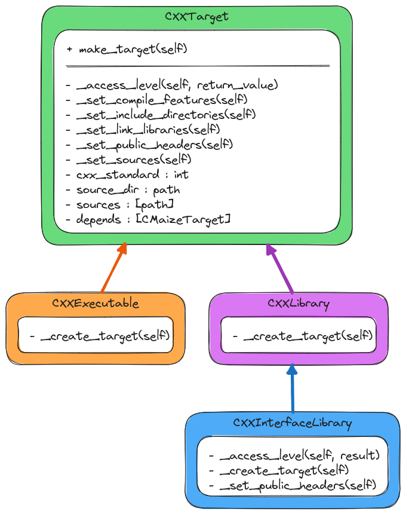

.. Copyright 2023 CMakePP
..
.. Licensed under the Apache License, Version 2.0 (the "License");
.. you may not use this file except in compliance with the License.
.. You may obtain a copy of the License at
..
.. http://www.apache.org/licenses/LICENSE-2.0
..
.. Unless required by applicable law or agreed to in writing, software
.. distributed under the License is distributed on an "AS IS" BASIS,
.. WITHOUT WARRANTIES OR CONDITIONS OF ANY KIND, either express or implied.
.. See the License for the specific language governing permissions and
.. limitations under the License.

.. _designing_cmaizes_cxx_target_classes:

#####################################
Designing CMaize's C++ Target Classes
#####################################

:ref:`designing_cmaizes_target_component` described the design of the language
agnostic pieces of CMaize's Target component. This page describes the design
of the Target component specific to C++ targets.

********************************
What are the C++ Target Classes?
********************************

As the name suggests, the C++ target classes are the classes in CMaize's Target
component which describe C++ targets including libraries and executables.

**********************************
Why Do We Need C++ Target Classes?
**********************************

CMaize's C++ target classes will provide an object-oriented representation of
CMake's native C++ targets. C++ target objects are needed to ensure that C++
targets can be treated in a manner that is compatible with CMaize's target
support for coding languages not supported by traditional CMake. CMaize's target
classes also help extract away much of the repetition resulting from using
CMake's C++ targets directly.

*************************
C++ Target Considerations
*************************

To motivate the considerations for the C++ Target classes consider the
traditional CMake workflow for setting up C++ targets:

.. code-block:: CMake

   # Step 1: Declare the target for the library
   add_library(...)

   # Step 2: Set compiler features needed by the target
   target_compile_features(...)

   # Step 3: Set up the include directories for the target. This includes the
   #         include paths needed to build the target and the include paths the
   #         target will need after it has been installed.
   target_include_directories(...)

   # Step 4: Ensure that the header files defining the public API of the target
   #         will be installed.
   install(...)

   # Step 5: Register the dependencies of the target
   target_link_libraries(...)

   # Step 6: Add source files to the target (if there are any)
   target_source(...)

   # Step 7: Decide where to install the target and configure the packaging
   #         file for finding the target
   install(...)

   # Step 8: Install the packaging file.
   install(...)

The above workflow is for C++ libraries, but is nearly identical to that of
an executable except that when building an executable step 1 calls
``add_executable`` instead of ``add_library``.

This leads to the following considerations:

.. _ct_cmake_target_creation:

CMake target creation
   :ref:`designing_cmaizes_target_component` called for each CMaize target to
   have an underlying CMake target. The various C++ target classes will be
   responsible for actually creating and initializing those targets.

.. _ct_cxx_libraries_and_executables:

C++ libraries and executables
    Software written in C++ is comprised of two types of objects: libraries and
    executables. The C++ target classes must be able to represent executables
    and libraries.

.. _ct_header_only_libraries:

header-only libraries
   Many modern C++ libraries are header-only. Conceptually, such libraries
   follow the same workflow, but skip step 6 (adding source files to the
   target). Unfortunately, CMake requires header-only libraries to provide
   different inputs for a number of the steps (in the above code snippet, the
   actual differences are part of the ellipses and are thus not shown). The
   C++ target classes should abstract away the differences between setting-up
   header-only and compiled libraries.

.. _ct_abstract_base:

abstract base
   As the above code snippet showed, the process for configuring and installing
   a C++ library is nearly identical to that of configuring and installing a
   C++ executable. The CMaize objects should factor out the common routines and
   abstract away the differences. From an object-oriented design standpoint this
   suggests a common abstract base class.

.. _ct_install_location:

install location
   CMake is great at managing targets during the build process; however,
   CMake requires the package maintainer to more or less manually configure how
   the target will behave after installation. This includes ensuring the package
   can still find all of its files and dependencies. This process is facilitated
   by having each target know where its install location will be.

*****************
C++ Target Design
*****************

.. _fig_cxx_target_design:

   The classes implementing CMaize's target component for C++ targets.

:numref:`fig_cxx_target_design` is a class diagram for the classes responsible
for modeling C++ targets. Following from consideration :ref:`ct_abstract_base`
we have introduced the ``CXXTarget`` class to factor out the common
infrastructure. The ``CXXTarget`` class implements the ``make_target`` function
defined by the ``BuildTarget`` class in terms of a series of virtual protected
member functions, i.e, ``_create_target``, ``_set_compile_features``,
``_set_include_directories``, ``_set_link_libraries``, and ``_set_sources``.

Following from the :ref:`ct_cxx_libraries_and_executables` consideration, we
derive from ``CXXTarget`` the ``CXXExecutable`` and ``CXXLibrary`` classes.
These classes simply override ``_create_target`` so that it calls
``add_executable`` or ``add_library``, respectively. Finally, to address the
:ref:`ct_header_only_libraries` consideration we derive the
``CXXInterfaceLibrary`` class from the ``CXXLibrary`` class.

Proposed API
============

To create a C++ library:

.. code-block:: CMake

   set(include_files ...) # Somehow get a list of header files
   set(source_files ...)  # Somehow get a list of source files

   # Create a library called "my_first_cmaize_cxx_library" and assign it to the
   # variable cxx_library
   CXXLibrary(CTOR cxx_library "my_first_cmaize_cxx_library")

   # Actually create the CMake target powering the library
   CXXLibrary(make_target
       "${cxx_library}"
       INCLUDES "${include_files}"
       SOURCES "${source_files}"
   )

*******
Summary
*******

:ref:`ct_cmake_target_creation`
   The literal CMake targets are created by the derived classes when overriding
   ``CXXTarget``'s ``_create_target`` function.

:ref:`ct_cxx_libraries_and_executables`
   The ``CXXLibrary`` and ``CXXExecutable`` classes respectively model a C++
   library and a C++ executable.

:ref:`ct_header_only_libraries`
   The ``CXXInterfaceLibrary`` class derives from the ``CXXLibrary`` class and
   modifies the workflows so that the underlying CMake calls are consistent with
   declaring a header-only library.

:ref:`ct_abstract_base`
   The ``CXXTarget`` class has been introduced to factor out common
   infrastructure.
