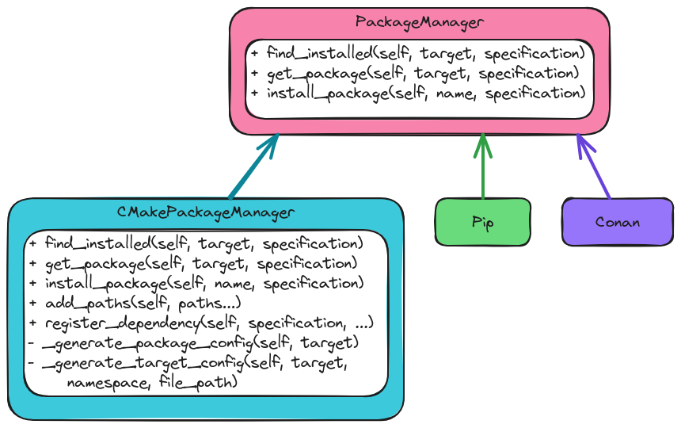

.. Copyright 2023 CMakePP
..
.. Licensed under the Apache License, Version 2.0 (the "License");
.. you may not use this file except in compliance with the License.
.. You may obtain a copy of the License at
..
.. http://www.apache.org/licenses/LICENSE-2.0
..
.. Unless required by applicable law or agreed to in writing, software
.. distributed under the License is distributed on an "AS IS" BASIS,
.. WITHOUT WARRANTIES OR CONDITIONS OF ANY KIND, either express or implied.
.. See the License for the specific language governing permissions and
.. limitations under the License.

.. _designing_cmaizes_packagemanager_component:

###########################################
Designing CMaize's PackageManager Component
###########################################

This page describes the design of the classes comprising CMaize's PackageManager
component.

*************************************
What is the PackageManager Component?
*************************************

Developers use CMaize to write the :term:`build system` for their project. As
part of that build system they state the dependencies which the project needs.
The PackageManager component is responsible for actually making those
dependencies available to the user, be it by finding already built versions, or
by building them.

******************************************
Why do we Need a PackageManager Component?
******************************************

The need for :term:`package manager` integrations was one of the high-level
considerations behind CMaize (see :ref:`package_manager_support`). The
PackageManager component is how CMaize addresses this consideration. It should
be noted that traditional CMake can be seen as having an underlying package
manager manager with ``find_package`` serving as the function for
locating existing packages and the ``FetchContent`` and/or ``ExternalProject``
modules actually building and installing the packages.

*****************************
PackageManager Considerations
*****************************

.. _pm_finding_packages:

finding packages
   The design discussion in :ref:`designing_cmaizes_user_api` decided that the
   package manager would be responsible for finding packages that meet the
   specifications needed by the :term:`project`. From the
   :ref:`designing_cmaizes_cmaizeproject_component` discussion it was decided
   that the specifications will be represented by ``PackageSpecification``
   objects.

.. _pm_building_packages:

building packages
   The design discussion in :ref:`designing_cmaizes_user_api` decided that the
   package manager would be responsible for building packages that
   the :term:`project` depends on.

.. _pm_installing_packages:

installing packages
   Brought up in :ref:`designing_cmaizes_cxx_target_classes`, the package
   manager is responsible for installing the built packages.

.. _pm_cmake_package_manager:

CMake package manager
   Historically, C++ build system maintainers have relied on CMake's package
   managing capabilities. To be backwards compatible, CMaize must support
   CMake's package manager. See :ref:`cmakes_package_manager` for more details
   on how traditional CMake is used as a package manager.

.. _pm_extendable:

extendable
   Ultimately we want to leverage existing package managers outside the CMake
   ecosystem. The PackageManager component should be able to wrap other
   package managers aside from the CMake manager.

*********************
PackageManager Design
*********************

.. _fig_package_manager:

   Overview of CMaize's PackageManager component.

:numref:`fig_package_manager` provides an overview of the PackageManager
component. Considerations :ref:`pm_finding_packages`,
:ref:`pm_building_packages`, and :ref:`pm_installing_packages` are addressed by
the abstract base class's :term:`API`. More specifically, each derived class is
charged with implementing mechanisms for finding (``find_installed``),
building (``get_package``), and installing (``install_package``) packages. The
mechanisms for using CMake's built in package manager are implemented by the
``CMakePackageManager`` class (consideration :ref:`pm_cmake_package_manager`).
Finally, we note that the :ref:`pm_extendable` consideration is addressed by
deriving new classes from the ``PackageManager`` base class.

*******
Summary
*******

:ref:`pm_finding_packages`
   Finding installed packages is done via the ``find_installed`` method. Each
   derived class must implement it appropriately.

:ref:`pm_building_packages`
   Obtaining and/or building a package is done by calling the ``get_package``
   method. Again, the derived class is responsible for implementing it in a
   manner which is appropriate for the backend.

:ref:`pm_installing_packages`
   Installing the package is abstracted away by the ``install_package``
   method. Classes derived from ``PackageManager`` must implement the method
   appropriately.

:ref:`pm_cmake_package_manager`
   The first package manager implemented in CMaize is the CMake package manager,
   which is represented by the ``CMakePackageManager`` class. The
   ``CMakePackageManager`` class leverages CMake's ``find_package`` function
   and the ``FetchContent`` module.

:ref:`pm_extendable`
   Extending the package manager component to additional package managers is
   straightforward and done by deriving new classes from ``PackageManager``.
