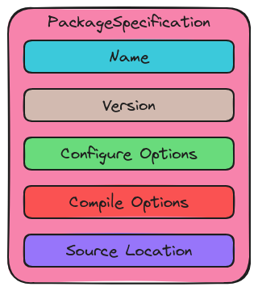

.. Copyright 2023 CMakePP
..
.. Licensed under the Apache License, Version 2.0 (the "License");
.. you may not use this file except in compliance with the License.
.. You may obtain a copy of the License at
..
.. http://www.apache.org/licenses/LICENSE-2.0
..
.. Unless required by applicable law or agreed to in writing, software
.. distributed under the License is distributed on an "AS IS" BASIS,
.. WITHOUT WARRANTIES OR CONDITIONS OF ANY KIND, either express or implied.
.. See the License for the specific language governing permissions and
.. limitations under the License.

.. _designing_package_specification:

###################################
Designing the Package Specification
###################################

Design discussions pertaining to the ``CMaizeProject`` component (see
:ref:`designing_cmaizes_cmaizeproject_component`) motivated the need for being
able to represent a package's specification. This page captures the design
process of the CMaize's ``PackageSpecification`` class.

********************************
What is a Package Specification?
********************************

When a :term:`project` is installed, the result is a :term:`package`. Generally
speaking the same project can result in multiple packages. This is because
projects evolve with time (e.g., new versions are released) and because most
projects can be built in a number of different ways (i.e., with different
versions of dependencies, with or without an optional feature, etc.). Package
specifications are meant to uniquely identify a package.

*************************************
Why Do We Need Package Specification?
*************************************

At the end of the day, the packaged dependencies used to build a project can
determine whether a build succeeds, the overall performance, and even the
correctness. It is therefore critical that CMaize be able to capture sufficient
package information so as to distinguish among different packages. The
``PackageSpecification`` class is charged with being able to represent the
contents of a package.

************************************
Package Specification Considerations
************************************

.. _ps_package_discernment:

package discernment
   The primary purpose of the package specification is to contain enough
   information so that CMaize can discern among existing packages (particularly
   from the same project). This requires knowing:

   - Package's name
   - Version
   - Configuration options (for packages built with CMake these are the CMake
     arguments used to configure the package).
   - Compilation arguments

.. _ps_source_location:

source location
   For packages CMaize is expected to obtain and/or build, we need to know where
   to find the package's source code. For most dependencies this will be a URL,
   but for some projects (notably the one being built) the source files may
   reside locally on disk.

   - It is expected that there will be packages that users will not want CMaize
     to obtain/build. For such packages, the source location can simply be left
     blank.

Out of Scope
============

deciding if a package matches a specification
   ``PackageSpecification`` objects are inputs to package managers. It is the
   package manager's job to determine if a package matches a provided
   specification. See `designing_cmaizes_packagemanager_component` for more
   details.

****************************
Package Specification Design
****************************

.. _fig_package_specification:

   Schematic illustration of the state of the ``PackageSpecification`` class.

:numref:`fig_package_specification` shows the ``PackageSpecification`` class's
state. The class itself is purely a data structure, meant to package all of the
information together. While the source location attribute is not applicable to
packages which have already been built, at present, we have opted to include it
on all ``PackageSpecification`` objects. This is simply to avoid introducing a
derived class to store one attribute. If management of the source location
becomes more complicated it may make sense to factor it out out into a derived
class.

*******
Summary
*******

:ref:`ps_package_discernment`
   The ``PackageSpecification`` class contains state capable of recording how
   the package was configured.

:ref:`ps_source_location`
   The ``PackageSpecification`` class stores the source location for packages
   CMaize is obtaining/building.
