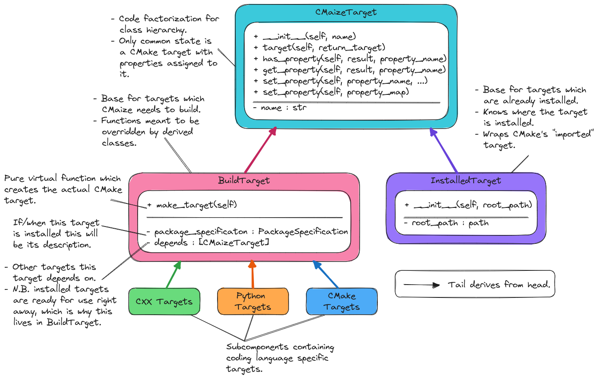

.. Copyright 2023 CMakePP
..
.. Licensed under the Apache License, Version 2.0 (the "License");
.. you may not use this file except in compliance with the License.
.. You may obtain a copy of the License at
..
.. http://www.apache.org/licenses/LICENSE-2.0
..
.. Unless required by applicable law or agreed to in writing, software
.. distributed under the License is distributed on an "AS IS" BASIS,
.. WITHOUT WARRANTIES OR CONDITIONS OF ANY KIND, either express or implied.
.. See the License for the specific language governing permissions and
.. limitations under the License.

.. _designing_cmaizes_target_component:

###################################
Designing CMaize's Target Component
###################################

This page records the design process of CMaize's target component.

.. _tc_what_is_cmaizes_target_component:

**********************************
What is CMaize's Target Component?
**********************************

CMaize's target component contains classes which represent traditional CMake
:term:`build targets<build target>`. Hence CMaize's target component can be seen
as the result of mapping CMake's functional approach to managing targets to
CMaize's object-oriented approach.

*****************************************
Why Do We Need CMaize's Target Component?
*****************************************

Since CMake already provides native support for targets, arguably the more
pertinent question is: "Why do we need an object-oriented target component?".
The original motivation for an object-oriented target component was to manage
complexity, while still providing a user-friendly interface. As the length of
the CMake `documentation <https://tinyurl.com/535scwpn>`__ for targets suggests,
there are many considerations which go into properly setting up a CMake target
and using that target throughout the build system. CMaize targets are designed
to manage those considerations via a separation of concerns. For example,
users creating a target for a C++ executable, via the ``CXXExecutable`` class
are only exposed to target properties which are relevant for executables,
whereas the native CMake API additionally exposes many other considerations
including: libraries, object libraries, and alias targets.

Another motivation for CMaize's target component is to extend CMake targets to
other coding languages. Out of the box, CMake targets are primarily meant for
use with C/C++ targets. Modern C/C++ projects often contain pieces written in
other coding languages, notably Python. Being able to treat these additional
project pieces with a unified build system decreases the project management
burden since maintainers do not need to learn multiple build systems.

*******************************
Target Component Considerations
*******************************

.. _tc_language_specific:

language specific
   :ref:`designing_cmaizes_add_target_functions` required the language-specific
   aspects of target creation to be managed by the various target classes.

.. _tc_language_agnostic:

language agnostic
   While perhaps seemingly at odds with :ref:`tc_language_specific`, we
   note that from the perspective of CMake, and CMaize, targets serve primarily
   as nodes in a :term:`DAG`. The language of the target is not relevant for
   assembling the DAG and it should thus be possible to work with already
   created targets in a language agnostic manner.

.. _tc_dependency_tracking:

dependency tracking
   :ref:`designing_cmaizes_cmaizeproject_component` established that each
   target will track the targets it depends on.

   - As a corollary we note that tracking dependencies is used for establishing
     build order.
   - For a working installed package we know that all dependencies have already
     been satisfied (otherwise the package would not currently be working).
     Downstream consumers of a working installed package do not need to track
     the package's dependencies because the package already does this for them.

.. _tc_cmake_based_targets:

cmake based targets
   Modern CMake is target-based. Since CMaize relies on CMake, CMaize will need
   to track the CMake targets which correspond to a given CMaize target.

***********************************
Design of CMaize's Target Component
***********************************

.. _fig_cmaize_targets:

   The overall architecture of CMaize's target component. Also shown are the
   API details of the language agnostic pieces of the component.
