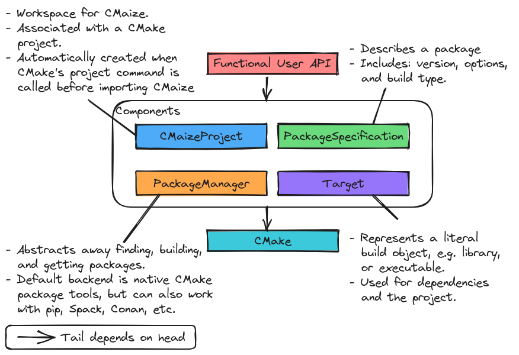

..
   Copyright 2023 CMakePP

   Licensed under the Apache License, Version 2.0 (the "License");
   you may not use this file except in compliance with the License.
   You may obtain a copy of the License at

   http://www.apache.org/licenses/LICENSE-2.0

   Unless required by applicable law or agreed to in writing, software
   distributed under the License is distributed on an "AS IS" BASIS,
   WITHOUT WARRANTIES OR CONDITIONS OF ANY KIND, either express or implied.
   See the License for the specific language governing permissions and
   limitations under the License.

.. _overview_of_cmaizes_design:

###########################
Overview of CMaize's Design
###########################

The point of this page is to capture the overall high-level design of the
CMaize project.

***************
What is CMaize?
***************

CMaize is a CMake module designed to streamline writing
:term:`build systems <build system>` for scientific software. Initial focus is
on
C++-based :term:`projects <project>`, but support for any language CMake
supports
is straightforward.

**********************
Why do we need CMaize?
**********************

.. note::

   For full discussion see :ref:`statement_of_need`.

The vast majority of build systems written for CMake are verbose and highly
redundant. Generally speaking, it seems that the broader CMake community has
accepted that this "is simply the way CMake build systems are" and has stopped
trying to improve them. Evidence for this claim comes from tutorials prominently
showcasing boilerplate code, the growing reliance on template repositories, and
the tried and true technique of copy/paste-ing CMake scripts from one project
into another. All of these approaches run afoul of the :term:`DRY` paradigm and
subsequently suffer from the same problems proponents of DRY seek
to avoid, *e.g.*, multiple sources of truth, lack of synchronization,
and coupling the logic of distinct units of code.

Given that CMake is a full-featured coding language, it is possible to write
abstractions as CMake extensions which will reduce the verbosity and redundancy,
but this is not often done. We speculate that the primary hurdle to developing
such abstractions is lack of support. Most support for scientific software is
aimed at method development and not at software maintenance/sustainability. As
a result build systems are low priority. This is why CMaize is needed. CMaize
will be a reusable, :term:`build tool` built on top of CMake designed to
streamline writing build systems, particularly build systems of scientific
software.

*********************
CMaize Considerations
*********************

.. _cmake_based_build_system:

cmake-based build system
   A number of non CMake-based build systems have been proposed for C++.
   Despite many of those build systems being arguably easier to use, CMake still
   remains the de facto choice. Point being, there is a significant amount of
   inertia against adopting non-CMake based build systems by C++ project
   maintainers. Thus the build system the user writes should rely on the
   CMake scripting language.

   - By having CMaize be written purely in CMake, we ensure that tooling built
     for CMake continues to work for projects which use CMaize as well. Of
     particular note are most integrated development environments.

.. _cmake_based_workflows:

cmake-based workflows
   CMake is the de facto build tool for C++-based projects. Most consumers who
   intend to compile a C++ based project from source, will have some familiarity
   with CMake's :term:`build phases <build phase>` and the corresponding CMake
   commands.
   We want CMaize to integrate as seamlessly as possible into existing CMake-
   based workflows. Ideally consumers building projects with CMaize build
   systems won't even know it!

.. _minimize_redundancy:

minimize redundancy
   Ultimately the goal of CMaize is to aid developers in writing a streamlined
   build system. Key to this effort is minimizing the redundancy that comes
   from traditional CMake-based build systems.

   - A lot of the redundancy build system maintainers face comes from
     finding, building, and installing packages (including the package
     the project results in).

.. _target_support:

target support
   Most of writing a build system is defining :term:`targets <build target>` and
   explaining how they depend on one another. In particular, CMaize needs to
   be able to support:

   - external packages
   - libraries
   - executables

   The aforementioned target types will need to be supported in multiple
   languages as well.

.. _package_manager_support:

package manager support
   Managing targets which refer to external packages is complicated and arguably
   the hardest part of writing a build system. In practice, managing external
   packages should really be the role of a :term:`package manager`. While
   CMake has integrated support for package management (mainly through the
   `FetchContent` module and the
   `find_package <https://tinyurl.com/4c7ak8pt>`_ function), this support
   places most of the onous on the user and does not play nicely with other
   package managers (such as ``pip``).

   - Many (if not most) C++ projects are designed for use with CMake's internal
     package manager.
   - Consideration :ref:`cmake_based_build_system` means that CMake-based APIs
     will be needed for each external package manager.

.. _object_oriented:

object-oriented
   Current computer science wisdom holds that abstractions are conceptually
   easier to implement using object-oriented programming.

   - CMake is a functional language, thus the :ref:`cmake_based_build_system`
     consideration means that if CMaize adopts object-oriented paradigms, it
     needs to do so "under the hood" to remain :term:`API` compatible with
     CMake.

.. _recursive:

recursive
   Most CMake-based build systems are recursive. More specifically it is often
   the case that a build system opts to build one or more dependencies,
   each of which may also rely on a CMake-based build system. Within the
   CMake-based build systems of each of those dependencies there may be even
   more dependencies with CMake-based build systems, etc.

   - Given the recursive nature it is important for all aspects of the build
     system to "think globally, but act locally."
   - As a CMake-based build system runs, there is only ever one "active"
     project. The active project is the project whose build system control is
     currently within.
   - Upon recursing into the CMake-based build system of a dependency the
     active project becomes the dependency.

************
Architecture
************

.. _fig_architecture:

   Overall architecture of CMaize.

:numref:`fig_architecture` illustrates the overall architecture of CMaize.
Following from :ref:`cmake_based_build_system` all CMaize infrastructure is
built on traditional CMake (denoted by the box labeled "CMake" at the bottom
of :numref:`fig_architecture`). Classes in the "Components"
box are written using the
`CMakePP Language <https://github.com/CMakePP/CMakePPLang>`_, which is a CMake
module providing the infrastructure necessary to write object-oriented CMake
scripts.

.. attention::

   In the following subsections we introduce the major components of CMaize.
   Many of these components are named for the primary class responsible for
   the component. To distinguish between the class and the component we adopt
   the convention that the component is referred to with normal text whereas the
   class is referred to in a code snippet. For example, CMaizeProject refers to
   the component and ``CMaizeProject`` refers to the class.

User API
========

.. note::

   Main discussion: :ref:`designing_cmaizes_user_api`.

Considerations :ref:`cmake_based_workflows` and :ref:`object_oriented` together
require us to write a functional-style user API over top of the classes CMaize
relies on. The "User API" component is responsible for collecting the project's
information and forwarding it to the underlying classes. Since users interact
exclusively with CMaize through the User API component, and the User API
is only charged with collecting information, it also helps address the
:ref:`minimize_redundancy` consideration by encapsulating the majority of the
needed calls to traditional CMake.

CMaizeProject
=============

.. note::

   Main discussion: :ref:`designing_cmaizes_cmaizeproject_component`.

The CMaizeProject component is responsible for tracking project information,
including version, dependencies, targets, etc. of the active project (see
consideration :ref:`recursive`). In addition to serving as a workspace of
sorts, ``CMaizeProject`` objects also
collect all of the information needed to eventually package the project, which
in turn addresses the :ref:`recursive` consideration.

PackageManager
==============

.. note::

   Main discussion: :ref:`designing_cmaizes_packagemanager_component`.

Superficially, ``PackageManager`` objects map project configurations
to packages. In practice, the requested package may not actually exist yet
and the ``PackageManager`` object may either need to build the package or tell
the user it can not find it. The PackageManager component is charged with
encapsulating the logic for finding or building packages. Of note, the
PackageManager component is charged with being able to rely on established
package managers for obtaining packages.

Target
======

.. note::

   Main discussion: :ref:`designing_cmaizes_target_component`.

Thinking of a ``PackageManager`` as a map, project configurations are the keys
and ``Target`` objects are the values. Thus ``Target`` objects
are charged with describing the actual package. This includes, for example,
knowing where the libraries and header files are located, as well as supporting
the consumption of the package. The reason this component is called the Target
component, and not the Package component, is because the component
is actually charged with describing the pieces of the package. Put another way,
a package is just a collection of targets.

*******
Summary
*******

:ref:`cmake_based_build_system`
   CMaize is written entirely in CMake and its required dependencies are also
   written entirely in CMake.

:ref:`cmake_based_workflows`
   CMaize is distributed as a CMake module and is designed to be included in
   a ``CMakeLists.txt`` file. In turn, the person or tool building the project
   still interacts with the project using the traditional CMake-based workflow.

:ref:`minimize_redundancy`
   The user API is charged with collecting the package's information via a
   series of functional-style calls and mapping it to the traditional CMake
   calls. So although all of CMake's usual verboseness and redundancy is still
   present, it is encapsulated under CMaize and the developer's build system
   obeys :term:`DRY`.

:ref:`target_support`
   CMaize's Target component is responsible for being able to generically
   handle any build targets the user may want to define. These include external
   packages as well as build targets needed by the current project.

:ref:`package_manager_support`
   Interacting with CMake's internal package manager, as well as external
   package managers, is covered by the PackageManager component.

:ref:`object_oriented`
   The internals of CMaize are object-oriented. Internally, CMaize has adopted
   the `CMakePP Language`_.

:ref:`recursive`
   The CMaizeProject component collects the information for the active project
   including the information needed for the project to be consumed by downstream
   users. All CMaize functions (as well as all CMake functions) are implemented
   in a manner consistent with "think globally, act locally".
