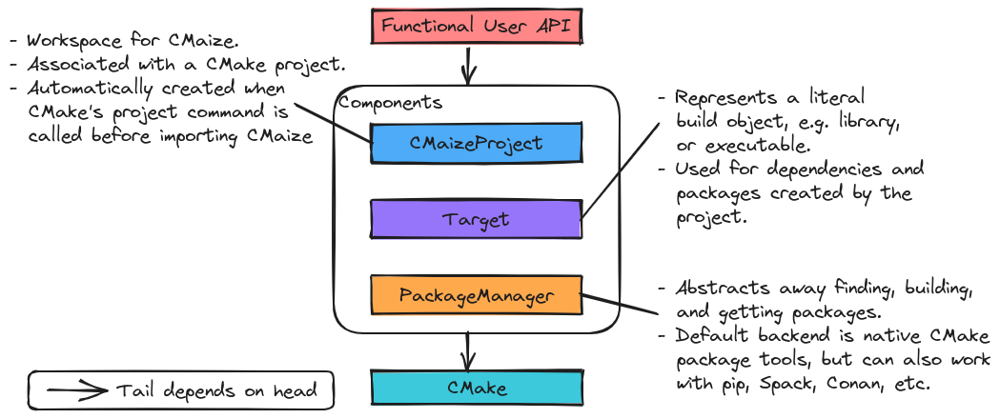

..
   Copyright 2023 CMakePP

   Licensed under the Apache License, Version 2.0 (the "License");
   you may not use this file except in compliance with the License.
   You may obtain a copy of the License at

   http://www.apache.org/licenses/LICENSE-2.0

   Unless required by applicable law or agreed to in writing, software
   distributed under the License is distributed on an "AS IS" BASIS,
   WITHOUT WARRANTIES OR CONDITIONS OF ANY KIND, either express or implied.
   See the License for the specific language governing permissions and
   limitations under the License.

.. _overview_of_cmaizes_design:

###########################
Overview of CMaize's Design
###########################

The point of this page is to capture the overall high-level design of the
CMaize project.

***************
What is CMaize?
***************

CMaize is a CMake module designed to streamline writing
:term:`build systems` for scientific software. Initial focus is on
C++-based :term:`projects`, but support for any language CMake supports
is straightforward.

**********************
Why do we need CMaize?
**********************

For full discussion see :ref:`statement_of_need`.

The vast majority of build systems written for CMake are verbose and highly
redundant. Generally speaking, it seems that the broader CMake community has
accepted that this "is simply the way CMake build systems are" and has stopped
trying to improve them. Evidence for this claim comes from tutorials prominently
showcasing boilerplate code, the growing reliance on template repositories, and
the tried and true technique of copy/paste-ing CMake scripts from one project
into another. All of these approaches run afoul of the
`"Don't Repeat Yourself (DRY)" <https://tinyurl.com/28x7h46c>`__ paradigm and
subsequently suffer from the same problems proponents of DRY seek
to avoid, *e.g.*, multiple sources of truth, lack of synchronization,
and coupling the logic of distinct units of code.

Given that CMake is a full-featured coding language, it is possible to write
abstractions as CMake extensions which will reduce the verbosity and redundancy,
but this is not often done. We speculate that the primary hurdle to developing
such abstractions is lack of support. Most support for scientific software is
aimed at method development and not at software maintenance/sustainability. As
a result build systems are low priority. This is why CMaize is needed. CMaize
will be a reusable, :term:`build tool` built on top of CMake designed to
streamline writing build systems, particularly build systems of scientific
software.

*********************
CMaize Considerations
*********************

.. _cmake_based_build_system:

cmake-based build system
   A number of non CMake-based build systems have been proposed for C++.
   Despite many of those build systems being arguably easier to use, CMake still
   remains the de facto choice. Point being, there is a significant amount of
   inertia against adopting non-CMake based build systems by C++ project
   maintainers. Thus the build system the user writes should rely on the
   CMake scripting language.

   - By having CMaize be written purely in CMake, we ensure that tooling built
     for CMake continues to work for projects which use CMaize as well. Of
     particular note are most integrated development environments.

.. _cmake_based_workflows:

cmake-based workflows
   CMake is the de facto build tool for C++-based projects. Most consumers who
   intend to compile a C++ based project from source, will have some familiarity
   with CMake's :term:`build phases` and the corresponding CMake commands.
   We want CMaize to integrate as seamlessly as possible into existing CMake-
   based workflows. Ideally consumers building projects with CMaize build
   systems won't even know it!

.. _minimize_redundancy:

minimize redundancy
   Ultimately the goal of CMaize is to aid developers in writing a streamlined
   build system. Key to this effort is minimizing the redundancy that comes
   from traditional CMake-based build systems.

   - A lot of the redundancy build system maintainers face comes from
     finding, building, and installing packages (including the package
     the project results in).

.. _object_oriented:

object-oriented
   Current computer science wisdom holds that abstractions are conceptually
   easier to implement using object-oriented programming.

   - CMake is a functional language, thus the :ref:`cmake_based_build_system`
     consideration means that if CMaize adopts object-oriented paradigms, it
     needs to don so "under the hood" to remain :term:`API` compatible with
     CMake.
   - CMaize developers can "avoid" having to write an object-oriented extension
     to CMake by using the
     `CMakePP Language <https://github.com/CMakePP/CMakePPLang>`_
     (quotes on avoid because the CMakePP Language is developed and maintained
     by the same organization as CMaize...).

.. _target_support:

target support
   :term:`Targets <target>`

.. _package_manager_support:

package manager support
   Arguably the hardest part of writing a build system is dependency management.
   Managing dependency distributions (*i.e.*, packages) has traditionally been
   the role of a :term:`package manager`.
   CMake has integrated :term:`package manager` support; however, CMake's
   package manager support does not always play nicely with widely used package
   managers, particularly those designed for non-C++ languages (*e.g.*,
   ``pip``). In practice, modern scientific C++ projects increasingly want to
   interact with external package managers, either because they want their
   project to be buildable via those package managers and/or because they want
   to use those package managers to build dependencies.

   - Note that because of the :ref:`cmake_based_build_system` consideration it
     is unlikely that C++ developers will migrate to alternative build systems
     and CMaize is thus faced with integrating package manager support into
     CMake.

************
Architecture
************

.. _fig_architecture:

   Overall architecture of CMaize.

:numref:`fig_architecture` illustrates the overall architecture of CMaize.
Following from :ref:`cmake_based_build_system` all CMaize infrastructure is
built on traditional CMake.

User API
========

Main discussion: :ref:`designing_cmaizes_user_api`.

Considerations :ref:`cmake_based_workflows` and :ref:`object_oriented` together
require us to write a functional-style user API over top of the classes CMaize
relies on. The "User API" component is responsible for collecting the project's
information and forwarding it to the underlying classes. Since users interact
exclusively with CMaize through the User API component, and the User API
is only charged with collecting information, it also helps address the
:ref:`minimize_redundancy` consideration by encapsulating the majority of the

CMaizeProject
=============

Main discussion: :ref:`designing_cmaizes_cmaizeproject_component`.

Behind the scenes CMaize will rely on four components, each of which is
associated with a class. The component associated with the ``CMaizeProject``
class will be responsible for tracking project information, including version,
dependencies, targets, etc. In addition to serving as a workspace of sorts,
the main purpose of the ``CMaizeProject`` class is to collect enough information
so that we can automatically generate a...

PackageSpecification
====================

Main discussion: :ref:`designing_cmaizes_packagespecification_component`.

PackageManager
==============

Main discussion: :ref:`designing_cmaizes_packagemanager_component`.

Target
======

Main discussion: :ref:`designing_cmaizes_target_component`.

*******
Summary
*******

:ref:`cmake_based_build_system`
   CMaize is written entirely in CMake and its required dependencies are also
   written entirely in CMake.

:ref:`cmake_based_workflows`
   Consumers interact with ``CMakeLists.txt`` written with CMaize no differently
   than they would with ``CMakeLists.txt`` written with CMake alone. Therefore,
   CMaize-based build systems seamlessly integrate into existing workflows.

:ref:`minimize_redundancy`
   The user API is charged with collecting the package's information and then
   mapping that to the usual CMake calls.

:ref:`object_oriented`
   CMaize has adopted the `CMakePP Language`_ under the hood.

:ref:`package_manager_support`
   This is covered by the PackageManager component.
