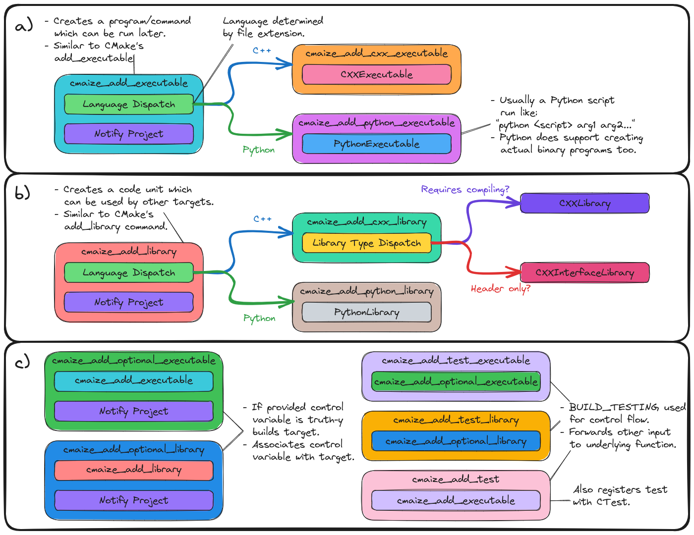

.. Copyright 2023 CMakePP
..
.. Licensed under the Apache License, Version 2.0 (the "License");
.. you may not use this file except in compliance with the License.
.. You may obtain a copy of the License at
..
.. http://www.apache.org/licenses/LICENSE-2.0
..
.. Unless required by applicable law or agreed to in writing, software
.. distributed under the License is distributed on an "AS IS" BASIS,
.. WITHOUT WARRANTIES OR CONDITIONS OF ANY KIND, either express or implied.
.. See the License for the specific language governing permissions and
.. limitations under the License.

.. _designing_cmaizes_add_target_functions:

#######################################
Designing CMaize's Add Target Functions
#######################################

The discussion on the :ref:`designing_cmaizes_user_api` page motivated the need
for user-facing functions for declaring and adding targets to the build system.

*****************************************
What Are the CMaize Add Target Functions?
*****************************************

CMaize's user-facing :term:`API` is comprised of functions designed to
integrate easily into CMake-style build systems. CMaize's add target functions
are the pieces of the user :term:`API` through which users can define
:term:`build targets<build target>`, i.e., the libraries, executables, etc.
comprising their :term:`project`. We refer to these functions as the "add
target" functions for generality.

***********************************************
Why Do We Need The CMaize Add Target Functions?
***********************************************

Users need a way to declare :term:`build targets<build target>`. Traditional
CMake provides only two add target functions:

- `add_library <https://cmake.org/cmake/help/latest/command/add_library.html>`_
- `add_executable <https://tinyurl.com/4pxh3cmf>`_

though it should be noted the `add_library`_ actually covers a number of use
cases, i.e., static libraries, shared libraries, interface libraries, modules,
and object libraries. Modern CMake is target-based and CMaize will ultimately
need to make targets in order to interact with CMake. Thus CMaize's add target
functions will necessarily wrap CMake's add target functions.

The primary reason CMaize needs wrapper functions is to capture the user's
input. More specifically, the CMaize versions of the add target functions will
record the target options in the active ``CMaizeProject`` so that CMaize will
be able to automate packaging of the project. Another motivation for
maintaining a separate set of CMaize add target functions is to
provide more succinct APIs. In practice, declaring CMake targets can be very
verbose and much of what needs to be provided can be inferred or learned from
other sources.

**********************
Add Target Terminology
**********************

CMaize will be dealing with targets associated with multiple coding languages.
Most coding languages organize code similarly, but differ in what they term
those organizational units. In order to provide a unified description we define
the following terms. We use these terms throughout this page regardless of what
the coding-language appropriate terms are.

.. glossary::

   executable
      A program meant to be run by a user. It may be compiled or it may not be,
      e.g., a Python script.

   library
      A collection of functionality distributed as a single packaged entity.
      Libraries are designed for consumption by other packages.

   source file
      Any file containing code. For languages like C++, "source file" includes
      header files.

As a slight aside, we choose these terms in order to conform to CMake's already
existing :term:`API`.

**********************************
Add Target Function Considerations
**********************************

.. _at_recording_targets:

recording targets
   The primary motivation for the add target functions is to serve as a
   mechanism for recording the details of the target.

.. _at_succinctness:

succinctness
   A lot of the information required by CMake's add target functions can be
   gleaned from other sources. Requiring the user to restate the information is
   verbose and violates :term:`DRY`.

.. _at_maintaining_best_practices:

maintaining best practices
   The best practice for how to set up a target will depend on a
   number of parameters including: the coding language, the build type, and
   the intended hardware architecture. Ideally CMaize will automate the creation
   of targets adhering to best practices.

.. _at_coding_languages:

coding language
   Exactly what targets can be built/found depend on the coding language(s) of
   the project. For example, shared/static :term:`libraries <library>` do not
   exist in the context of building Python code, but do exist when building
   C/C++ code.

   - Targeted coding languages include: C, C++, CMake, Fortran, Python, and
     extensions of the aforementioned languages (e.g., CMaize, CUDA and OpenMP).

.. _at_target_sources:

target sources
   Targets are usually associated with :term:`source files<source file>`.

   - As a corollary we note that source files usually fall into two categories,
     public and private. Public source files need to be redistributed with the
     target, whereas private source files are consumed in building the target.

.. _at_conditional_targets:

conditional targets
   Many projects contain targets which are only conditionally built. These
   targets may be optional package features, or targets only needed for testing
   or maintaining the project. In our experience, in a traditional CMake-based
   :term:`build system`, it is rarely possible to isolate the logic for these
   targets because CMake requires them to be specified in multiple places. We
   assume the following about a conditional target:

   - is conditionally included based on the value of a variable (if it's
     actually multiple variables, the user, via boolean logic, can combine the
     variables into a single variable). For optional features the variable is
     usually something like ``ENABLE_XXX``; for tests the variable is
     ``BUILD_TESTING`` (defined by CMake).
   - needs to be conditionally built, linked to, tested, and packaged. In other
     words, when CMaize is given a list of targets, CMaize needs to skip
     conditional targets which are not currently enabled.

**********************************
Design of the Add Target Functions
**********************************

.. _fig_add_target_functions:

   The user API for defining targets. Also shown is how the inputs to the user
   API ultimately map to underlying objects. a) Functions related to creating
   an executable. b) Functions related to creating a library. c) Conditional
   functions wrapping functions from a) and b).

:numref:`fig_add_target_functions` summarizes the functions implementing the
front end of CMaize's target component. As part of the user :term:`API`, the
front end is function-based (see :ref:`functional_style`). Each box in
:numref:`fig_add_target_functions` represents a function ("snake_case" labels),
section of a function (boxes labeled with phrases), or an object
("UpperCamelCase" labels). Nested boxes represent the parts of the function.

As mentioned above, one of the main considerations for CMaize's add target
functions is :ref:`at_recording_targets`. In :numref:`fig_add_target_functions`
recording the target information is done in the boxes labeled "Notify Project".
The other major consideration for CMaize's add target functions is
:ref:`at_succinctness`. Succinctness is the motivation for the dispatch steps.
To clarify, CMaize is able to avoid requiring the user to specify some of the
target's properties (e.g., language, header-only) simply by analyzing the
:term:`source files <source file>` the user provides. Conceivably it is possible
to glean even more details (for example the C++/Python version used) from the
source file contents; however, CMaize currently makes no attempt to do so.

While the API of the add target functions is language agnostic, consideration
:ref:`at_coding_languages` means the backend can not be. As shown in
:numref:`fig_add_target_functions`, both ``cmaize_add_executable`` and
``cmaize_add_library`` ultimately dispatch to language-specific target objects.
In this sense, CMaize's add target functions can be thought of as factory
routines.

***************
Add Target APIs
***************

The APIs for ``cmaize_add_executable`` and ``cmaize_add_library`` were
briefly introduced in the :ref:`designing_cmaizes_user_api` section. Generally
speaking the two functions work similarly aside from the fact that
``cmaize_add_executable``/\ ``cmaize_add_library`` will ultimately map to
CMake's ``add_executable``/\ ``add_library`` function, respectively (the calls
to the CMake functions happen inside the target objects). Given the similar APIs
we presently limit our focus to ``cmaize_add_library``:

.. code-block:: CMake

   # A typical C++ invocation
   cmaize_add_library(
       "<target name>"
       SOURCE_DIR "<directory containing private source files>"
       INCLUDE_DIRS "<directory(s) containing public source files>"
       DEPENDS "<name of dependency 0>" "<name of dependency 1>"
   )

   # A typical Python invocation
   cmaize_add_library(
       "<target name>"
       SOURCE_DIR "<directory containing the Python library>"
       DEPENDS "<name of dependency 0>" "<name of dependency 1>"
   )

As shown neither invocation directly says anything about the coding language
of the target. CMaize will determine this by looking at the file extensions
(e.g., ``*.py`` will signals a Python library, whereas ``*.h`` and ``*.cpp``
signal a C++ library; file extension mappings are managed by
`global configuration options <https://tinyurl.com/y63thveu>`_). Compared to
CMake's ``add_library`` command CMaize's API does not require:

- individual source files to be declared,
- a separate call to ``target_include_directories`` (which requires include
  files to be specified), nor does it require
- labeling of interface libraries.

Having to only specify directories, as opposed to source files, leads to much
more succinct interface than the CMake versions (it also largely negates the
need for separate ``CMakeLists.txt`` files for each target).

.. note::

   Experienced CMake developers may be aware of the pitfalls pertaining to
   ``file(GLOB`` vs. listing individual source files (see for example
   `here <https://tinyurl.com/3u6wrw86>`__). Under the hood CMaize takes care
   to make sure that adding/deleting files will rerun CMake to pick up the
   changes. Unfortunately, there is some overhead associated with our current
   strategy. If/when a new implementation is pursued it will not break the
   current API, i.e., CMaize's APIs remain committed to specifying target
   source files by directory.

The final consideration, :ref:`at_conditional_targets`, is addressed by a series
of functions which wrap ``cmaize_add_executable`` and ``cmaize_add_library``.
Respectively ``cmaize_add_optional_executable`` and
``cmaize_add_optional_library`` extend ``cmaize_add_executable`` and
``cmaize_add_library`` to associate a control variable with the target. The
APIs are:

.. code-block:: CMake

   cmaize_add_optional_executable(
       "<same API as cmaize_add_executable>"
       ENABLED_BY "<variable>"
   )

   cmaize_add_optional_library(
       "<same API as cmaize_add_library>"
       ENABLED_BY "<variable>"
   )

In the above code snippet ``<variable>`` is the CMake variable controlling the
inclusion of a the optional target. When ``<variable>`` contains a truth-y
value the target is included in the project, otherwise it is ignored. Since
most packages will have test components, which are usually optional, we also
propose the convenience functions:

.. code-block:: CMake

   cmaize_add_test_executable(
       "<same API as cmaize_add_executable>"
   )

   cmaize_add_test_library(
       "<same API as cmaize_add_library>"
   )

   cmaize_add_test(
      "<same API as cmaize_add_test_executable>"
   )

CMake defines the "ENABLED_BY" variable for tests to be ``BUILD_TESTING``.
``cmaize_add_test_executable``/\ ``cmaize_add_test_library`` respectively wrap
``cmaize_add_optional_executable``/\ ``cmaize_add_optional_library`` and
hardcode the "ENABLED_BY" variable to be ``BUILD_TESTING``.
``cmaize_add_test`` is a convenience wrapper around
``cmaize_add_test_executable`` which also automatically registers the resulting
executable with CTest.

*******
Summary
*******

:ref:`at_recording_targets`
   All functions meant to be called by users of CMaize will record the target's
   information in the active project.

:ref:`at_succinctness`
   CMaize analyzes source code to determine language and library type. Beyond
   that the APIs are designed to require as little information as possible,
   e.g., directories instead of files.

:ref:`at_maintaining_best_practices`
   Following from the :ref:`at_succinctness` consideration, the add target APIs
   place an emphasis on specifying the source file assets associated with the
   target and leaving CMaize to work out the remaining properties of the target.
   In turn, it becomes CMaize's responsibility to set the targets up following
   best practices, thereby removing the burden from the caller.

:ref:`at_coding_languages`
   CMaize's various add target functions serve as factory functions for creating
   language-specific target objects.

:ref:`at_target_sources`
   Users provide CMaize with directories, not individual source files. This
   facilitates CMaize picking up new files automatically.

:ref:`at_conditional_targets`
   A series of convenience functions are provided which associate a control flow
   variable with a target. When the control flow variable has a truth-y value
   the target is built, linked against, installed, etc. Otherwise it is skipped.
