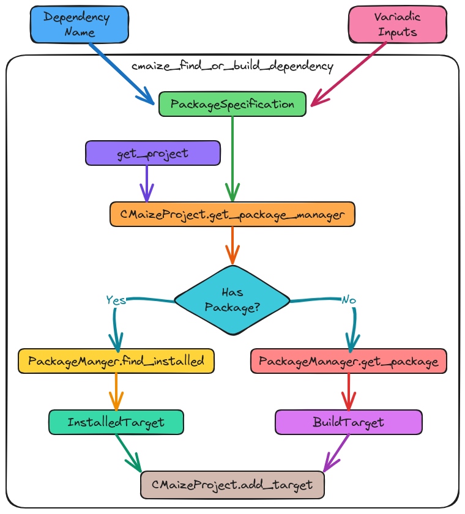

.. Copyright 2023 CMakePP
..
.. Licensed under the Apache License, Version 2.0 (the "License");
.. you may not use this file except in compliance with the License.
.. You may obtain a copy of the License at
..
.. http://www.apache.org/licenses/LICENSE-2.0
..
.. Unless required by applicable law or agreed to in writing, software
.. distributed under the License is distributed on an "AS IS" BASIS,
.. WITHOUT WARRANTIES OR CONDITIONS OF ANY KIND, either express or implied.
.. See the License for the specific language governing permissions and
.. limitations under the License.

.. _designing_cmaize_find_or_build_dependency:

####################################################
Designing CMaize's Find or Build Dependency Function
####################################################

This page describes the process of designing the ``find_or_build_dependency``
function.

***************************************************
What is CMaize's Find or Build Dependency Function?
***************************************************

The ``find_or_build_dependency`` function is the user-facing function CMaize
provides to help developers manage their project's dependencies. Under the hood
the ``find_or_build_dependency`` function is responsible for mapping the user's
dependency needs to a target (a build target if the :term:`build system` will
build it and an install target if it already exists). This mapping is done via
the package manager component (see
:ref:`designing_cmaizes_packagemanager_component`).

***************************************************
Why Do We Need a Find or Build Dependency Function?
***************************************************

The need for the ``find_or_build_dependency`` function arose in the discussions
of the overall user :term:`API` (see :ref:`designing_cmaizes_user_api`). In
particular, CMaize is designed to rely on existing packaging managers. The
``find_or_build_dependency`` API abstracts away the details of how those
package managers work so that CMaize consumers can simply specify the dependency
details.

************************************************
Find or Build Dependency Function Considerations
************************************************

.. _fbd_cmake_based:

CMake based
   As user-facing functionality, the ``find_or_build_dependency`` function
   should have an interface which is consistent with traditional CMake. In
   particular this means the input should be strings and the result should be
   the name of a traditional CMake target.

.. _fbd_wrap_package_managers:

wrap package managers
   As stated above, one of the primary reasons for this function is to abstract
   away the details of how CMaize interacts with the underlying package
   managers.

   - As a corollary, this also means that ``find_or_build__dependency`` must be
     able to accept whatever input is needed for the various package manager
     backends.

.. _fbd_cmake_target:

CMake target
   The user of the ``find_or_build_dependency`` function will provide a name
   for the dependency. That name will be tied to that particular invocation of
   ``find_or_build_dependency`` and will represent that specific package
   specification. This is explicitly done by creating a traditional CMake target
   under the provided name.

   - As a corollary, if the user wants to have multiple specifications of a
     package, then there must be be multiple calls to
     ``find_or_build_dependency``, each call must provide a unique name.
   - The user should continue to refer to this package specification via the
     provided name, e.g., when using it as a dependency for another
     ``find_or_build_dependency`` call or when specifying the project's
     assets (e.g., ``cmaize_add_library``)

****************************************
Find or Build Dependency Function Design
****************************************

.. _fig_find_or_build_dependency:

   Overview of the control flow in the ``find_or_build_dependency`` function.

The control flow of ``find_or_build_dependency`` is diagramed in
:numref:`fig_find_or_build_dependency`. In addressing the :ref:`fbd_cmake_based`
consideration the inputs to the ``find_or_build_dependency`` function are the
name of the dependency and any inputs needed to specify the dependency (e.g.,
version or URL) and any necessary build options. Internally,
``find_or_build_dependency`` then:

1. Converts the dependency's information into a ``PackageSpecification`` object.
2. Obtains the active ``CMaizeProject`` object.
3. Gets the active ``PackageManager`` from the ``CMaizeProject`` object.
4. Determines if the ``PackageManager`` object has a dependency matching the
   ``PackageSpecification`` object.
5. If yes, then the ``PackageManager`` retrieves the already installed
   dependency which is returned as a ``InstalledTarget`` object.
6. If no, then the ``PackageManager`` creates a ``BuildTarget`` object which
   will be built during the build phase.
7. Finally the target is registered to the active ``CMaizeProject`` object.

In turn, ``find_or_build_dependency`` thus works like a driver managing the
interactions of the ``CMaizeProject`` object with the ``PackageManager``
objects. The reliance on a ``PackageManager`` object addresses the
:ref:`fbd_wrap_package_managers` consideration.

**********
API Design
**********

The :term:`API` of the ``find_or_build_dependency`` function must be capable of
accepting whatever input a ``PackageSpecification`` object may need. This is
because the ``PackageManager`` will ultimately work with the
``PackageSpecification``. To that end, the API will accept a number of
:term:`kwargs` which will be forwarded to the ``PackageSpecification`` and the
basic API will be:

.. code-block:: CMake

   cmaize_find_or_build_dependency(name_of_dependency <kwargs>)

Here ``name_of_dependency`` will be the base name assigned to the CMake target,
as required by the :ref:`fbd_cmake_target` consideration. N.B., "CMake target"
in this context refers to a traditional CMake target, NOT a CMaize object.
Users should continue to refer to the dependency as ``name_of_dependency`` in
all future CMaize calls, e.g.:

.. code-block:: CMake

   cmaize_find_or_build_dependency(foo <kwargs>)
   cmaize_find_or_build_dependency(bar DEPENDS foo <other_kwargs>)

*******
Summary
*******

:ref:`fbd_cmake_based`
   The ``find_or_build_dependency`` function relies on traditional CMake inputs
   and ultimately produces a native CMake target which is used by dependees.

:ref:`fbd_wrap_package_managers`
   The body of the ``find_or_build_dependency`` function relies on
   ``PackageManager`` instances to actually find and/or build the various
   dependencies.

:ref:`fbd_cmake_target`
   The ``BuildTarget`` and ``InstalledTarget`` classes are responsible for
   ensuring that a traditional CMake target is created under the name the
   user provides to the ``find_or_build_dependency`` function.
