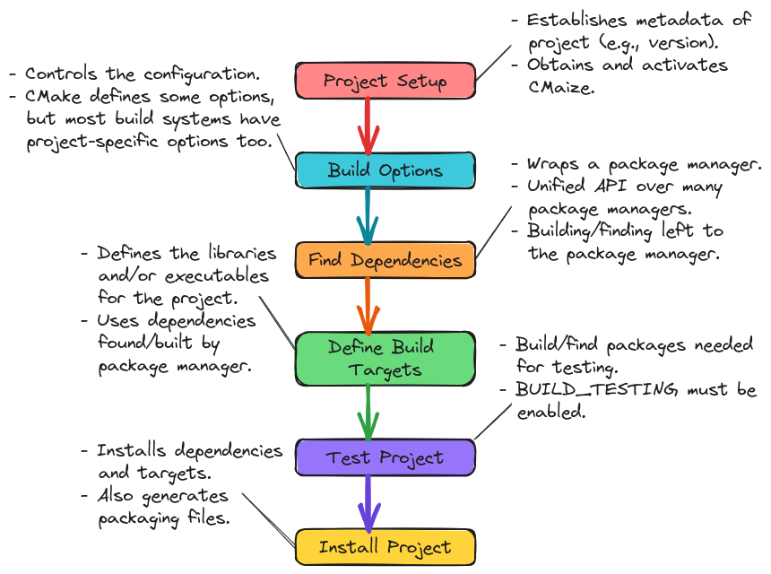

.. Copyright 2023 CMakePP
..
.. Licensed under the Apache License, Version 2.0 (the "License");
.. you may not use this file except in compliance with the License.
.. You may obtain a copy of the License at
..
.. http://www.apache.org/licenses/LICENSE-2.0
..
.. Unless required by applicable law or agreed to in writing, software
.. distributed under the License is distributed on an "AS IS" BASIS,
.. WITHOUT WARRANTIES OR CONDITIONS OF ANY KIND, either express or implied.
.. See the License for the specific language governing permissions and
.. limitations under the License.

.. _designing_cmaizes_user_api:

####################################
Overview of CMaize's User API Design
####################################

:ref:`overview_of_cmaizes_design` called for CMaize to have a functional-style
user :term:`API` written over top of the object-oriented core. This page
describes the design of CMaize's user API.

**************************
What is CMaize's User API?
**************************

To be used as a :term:`build system`, CMaize will provide interfaces for
controlling behavior of the :term:`build phases <build phase>`. These interfaces
define the user :term:`API` of CMaize and determine how the user will
implement their :term:`project's <project>`:term:`build system`.

********************************
Why Does CMaize Need a User API?
********************************

At a fundamental level, CMaize needs a user API because CMaize will have users
who need to be able to interface with CMaize. The more pertinent
question is, "Why do we need a functional-style user API modeled after CMake?"
To that end, we want to design CMaize's user :term:`API` in a manner which
simplifies writing the :term:`build system` for a :term:`project`. At the
same time, we want to facilitate converting existing CMake-based build
systems to CMaize-based build systems. Since CMake is a functional language,
having a functional-style user API facilitates the conversion.

***********************
User API Considerations
***********************

.. _ua_cmake_based:

cmake-based
   Stemming from the :ref:`cmake_based_build_system` consideration raised as
   part of the design discussions at :ref:`overview_of_cmaizes_design`, it was
   decided that the user-facing :term:`API` of CMaize needed to be written in
   traditional CMake.

.. _functional_style:

functional style
   CMake is a functional-style language. Therefore based on the
   :ref:`ua_cmake_based` consideration, the user :term:`API` should adhere to
   functional-style programming.

.. _cmake_to_cmaize:

CMake to CMaize
   Somewhat of a corollary to the :ref:`ua_cmake_based`
   consideration, user adoption of CMaize is facilitated by having the
   conversion from an existing CMake-based build system to a CMaize-based build
   system be as easy as possible.

   - Generally speaking most CMake :term:`build systems <build system>` follow
     the same flow:

      #. Declare the :term:`project`'s meta data including name, version, etc.
      #. Declare configuration options
      #. Find the dependencies
      #. Setup the :term:`project`'s targets
      #. Install the targets

.. _ua_minimize_redundancy:

minimize redundancy
   One of the motivating considerations for creating CMaize was
   :ref:`minimize_redundancy`. Satisfying this consideration is the job of
   CMaize's user API since ultimately any CMaize-based build system will be
   written using the user API.

.. _ua_package_manager:

package manager
   Building/packaging a dependency/project can be a complicated endeavor. From
   :ref:`overview_of_cmaizes_design`, it has been established that CMaize will
   have :term:`package manager` support. In many cases CMaize serves as a
   unified API for collecting build system data and shuttling it to the package
   manager. It is thus essential that the user API collects all of the data
   necessary to drive the package manager.

*****************
Proposed User API
*****************

.. _fig_user_api:

   Anticipated control flow of a CMaize-base build system.

This section introduces a high-level overview of CMaize's user API. The
functions comprising the user API are grouped into categories based on the
steps presented in consideration :ref:`cmake_to_cmaize` and shown in
:numref:`fig_user_api`. Most of the following
subsections are simply summaries of more detailed design discussions (links to
those design discussions are provided) and do not explicitly touch on all
considerations. This is particularly pertinent in the subsections dealing with
declaring and building dependencies and targets.

Project Setup
=============

Following from the :ref:`ua_cmake_based` consideration, the
build system the user writes with CMaize should be pure CMake and invoked by
running CMake on a ``CMakeLists.txt`` file. CMake requires that the first lines
of code be:

.. code-block:: CMake

   # Ellipses elide project-specific data and are not part of the API.
   cmake_minimum_required(...)
   project(...)

The next step is to obtain CMaize. This is done through ``FetchContent``.
Since CMaize is not in scope yet, obtaining CMaize must be done with the
interfaces provided by traditional CMake and CMaize can not be used to
reduce the boilerplate. The code needed to obtain, and load, CMaize is:

.. code-block:: CMake

   include(FetchContent)
   FetchContent_Declare(
       cmaize
       GIT_REPOSITORY https://github.com/CMakePP/CMaize
   )
   FetchContent_MakeAvailable(cmaize)
   include(cmaize/cmaize)

At this point we have CMaize loaded and in scope and encourage the user to use
CMaize's APIs as much as possible from this point forward. That said, we note
that CMaize will rely on traditional CMake targets, so it is possible to mix
and match traditional CMake and CMaize code.

It is worth noting that the ``include(cmaize/cmaize)`` line actually initializes
CMaize (full details can be found at :ref:`cmaize_initialization`).

Build Options
=============

The next step for most :term:`build systems <build system>` is to define the
:term:`build process` options (beyond those intrinsic to CMake itself). Each
option has three parts:

#. The variable name storing the option's value.
#. A description.
#. A default value.

In traditional CMake, the description is primarily intended for use by CMake's
:term:`GUI` and the value is restricted to being a boolean. In our experience
users typically build CMake programs through the :term:`CLI`, which makes the
description somewhat of a superfluous input; however, we still see value in
including it in the :term:`API` because, one, we need it to call CMake's
`option <https://cmake.org/cmake/help/latest/command/option.html>`_ command,
and two, it serves as metadata CMaize can leverage (for example to auto-generate
build documentation). Allowing options to have values, other than boolean, is
useful to avoid having to have a series of options like: ``enable_vendor0``,
``enable_vendor1``, *etc*. Instead the :term:`build system` can simply define a
single option, say ``vendor``, which can just be set to a string denoting the
vendor to enable.

With the above considerations in mind, the proposed CMaize API is:

.. code-block:: CMake

   cmaize_option(enable_feature0 "Feature 0 is used to do something" FALSE)
   cmaize_option(target_platform "What GPU type to target?" NVIDIA)

Aside from the function name and the fact ``cmaize_option`` accepts values other
than booleans, the API is identical to the API CMake uses for its `option`_
command. This is by design and stems from the :ref:`cmake_to_cmaize`
consideration.

In addition to ``cmaize_option``, we also propose the ``cmaize_option_list``
command for setting multiple options at once. Here the motivation is that some
:term:`projects <project>` need to define many options, which
would lead to many calls to ``cmaize_option``. Using
``cmaize_option_list`` the above snippet would be:

.. code-block:: CMake

   cmaize_option_list(
      enable_feature0 "Feature 0 is used to do something" FALSE
      target_platform "What GPU type to target?" NVIDIA
   )

While this won't necessarily cut down on the number of lines (we still expect
that most build systems will declare one option per line), it is cleaner since
it avoids having to repeat ``cmaize_option`` on each line. In practice,
``cmaize_option_list`` simply wraps looping over "name, description, value"
triples and feeding them to ``cmaize_option``.

Find Dependencies
=================

Full discussion: :ref:`designing_cmaize_find_or_build_dependency`.

Configuration settings describe many aspects of a build, including what
dependencies are needed. With the configuration options established, the next
step of most builds is to find dependencies. While there a plethora of
edge cases when it comes to finding dependencies, in most cases CMaize "just"
needs to know where to look. CMake already provides mechanisms for users to
provide hints for finding packages (*e.g.* ``CMAKE_PREFIX_PATH``) which CMaize
can leverage. The output of finding a dependency is a CMake target which can be
consumed by other CMake targets.

If a package is not found, a :term:`build system` has two options: error out or
try to build the package. Modern CMake simplifies the process of building
dependencies which also rely on CMake-based build systems (including those using
CMaize-based build systems) through CMake's
`FetchContent <https://cmake.org/cmake/help/latest/module/FetchContent.html>`_
module. While there
are many edge cases again, generally CMaize can build the
dependency if it knows:

- where to obtain the dependency from,
- the target version of the dependency,
- values for the configuration options, and
- the package manager to use (if not :ref:`cmakes_package_manager`).

From these considerations, we propose the following user APIs for finding and
building dependencies with CMaize:

.. code-block:: CMake

   # For building a dependency if it can not be found
   cmaize_find_or_build_dependency(
      <name>
      URL <where_on_the_internet_to_download_from>
      VERSION <the_version_you_want>
      BUILD_TARGET <target_to_build>
      FIND_TARGET <target_representing_package>
      CMAKE_ARGS <configuration_options_to_set>
   )

   #Or if the build system wants to insist that a dependency must already exist
   cmake_find_dependency(
      <name>
      VERSION <the_version_you_want>
      FIND_TARGET <target_representing_package>
      CMAKE_ARGS <options_it_should_have_been_configured_with>
   )

In practice, following from the :ref:`ua_package_manager` consideration, these
functions are envisioned as wrappers over a :term:`package manager`. The main
goal of the user API is to collect the information needed for the package
manager to build the dependency and for CMaize to use the dependency the package
manager builds.

Define Build Targets
====================

Full discussion: :ref:`designing_cmaizes_add_target_functions`.

Once we have found or built all of the :term:`project's <project>` dependencies,
we can move on to building the :term:`build targets <build target>`. Generally
speaking, the information needed to build a target depends on the coding
language of the target. For the purposes of this high-level discussion, we focus
on C++; build targets for most other coding languages will have similar needs.
For a typical C++ target we need to specify the:

- name of the build target,
- source files defining the build target's implementation,
- header files defining the build target's public :term:`API`, and
- build target's dependencies (including other build targets).

The proposed CMaize APIs are:

.. code-block:: CMake

   # Declaring a build target for a (C++) library
   cmaize_add_library(
      <name>
      SOURCE_DIR <where_the_source_files_are_located>
      INCLUDE_DIRS <directories_containing_header_files>
      DEPENDS <dependency0> <dependency1> ...
   )

   # Declaring a build target for a (C++) executable is similar
   cmaize_add_executable(
      <name>
      SOURCE_DIR <where_the_source_files_are_located>
      INCLUDE_DIRS <directories_containing_header_files>
      DEPENDS <dependency0> <dependency1>
   )

Like the "Find Dependencies" step before it, the APIs for defining build targets
are designed primarily for collecting information pertaining to the build
target. Unlike the "Find Dependencies" step, the backend of API calls for
defining build targets is CMake. The results of calling these methods are
properly configured CMake targets.

Test Project
============

After targets are built, the next step is to test that they were built correctly.
Testing build targets with CMake often requires:

- finding dependencies of the testing framework,
- building testing targets which consume the project's build targets, and
- registering the tests with CTest.

It is also worth noting that tests are often built conditionally (e.g., a
:term:`build system` typically does not build the tests of dependencies built
during the "Find Dependencies" step). To that end CMake defines the
``BUILD_TESTING`` variable; when set to ``TRUE`` tests are built, otherwise they
are not. Proposed CMaize APIs for testing a project:

.. code-block:: CMake

   cmaize_find_or_build_test_dependency(
       <name>
       URL <where_on_the_internet_to_download_from>
       VERSION <the_version_you_want>
       BUILD_TARGET <target_to_build>
       FIND_TARGET <target_representing_package>
       CMAKE_ARGS <configuration_options_to_set>
   )

   cmaize_add_test_library(
       <name>
       SOURCE_DIR <where_the_source_files_are_located>
       INCLUDE_DIRS <directories_containing_header_files>
       DEPENDS <dependency0> <dependency1> ...
   )

   cmaize_add_test_executable(
       <name>
       SOURCE_DIR <where_the_source_files_are_located>
       INCLUDE_DIRS <directories_containing_header_files>
       DEPENDS <dependency0> <dependency1> ...
   )

   # This is actually CTest's add_test command
   add_test(NAME <name> COMMAND)

   # This is a convenience function for the common scenario where the
   # add_test call simply calls the executable arising from the
   # cmaize_add_test_executable
   cmaize_add_test(
       <name>
       SOURCE_DIR <where_the_source_files_are_located>
       INCLUDE_DIRS <directories_containing_header_files>
       DEPENDS <dependency0> <dependency1> ...
   )

All of the test functions are thin wrappers around the non-test functions of
the same name (e.g., ``cmaize_add_test_library`` wraps ``cmaize_add_library``),
which hide the logic for including the CTest CMake module, and checking that
``BUILD_TESTING`` is enabled (if it's not the functions are no-ops).

Install Project
===============

If the tests are successful (or were skipped), the next step is :term:`package`
installation. Installation typically requires specifying which targets are
part of the package, generating the packaging files, and then
moving the targets and files to their final location. The main considerations
for installing are:

- Collecting sufficient information to be able to install the package including:

   - where it goes,
   - which pieces get installed, and
   - what the runtime dependencies are.

- Installation should be done in a manner which considers the package manager.

The proposed installation :term:`API` is:

.. code-block:: CMake

   cmaize_add_package(
       <name>
       NAMESPACE <namespace>
       TARGETS <target0> <target1> ...
   )

Each of the user API calls proceeding ``cmaize_add_package`` record the
information provided. In turn when it comes time to write the packaging files
and install the package, CMaize can do so in a largely automatic manner simply
by inspecting the information which was already provided. If the user wants to
fine-tune the package installation there are a number of options they can supply
including:

- the namespace to use in the package files (CMake allows prepending a prefix to
  an installed target's name to avoid naming collisions), and
- the specific targets to install (by default only the target with the same
  name as ``<name>`` is installed).

*******
Summary
*******

:ref:`ua_cmake_based`
   CMaize's user :term:`API` is designed to be invoked directly from the
   :term:`project's <project>` ``CMakeLists.txt`` as part of the usual CMake
   build procedure.

:ref:`functional_style`
   All user-facing APIs are designed to be functional in nature so as to
   seamlessly integrate with traditional CMake-based build systems.

:ref:`cmake_to_cmaize`
   Where possible the user-facing CMaize APIs rely on the same keywords and
   structure as the CMake APIs they wrap. Converting a CMake-based build system
   to a CMaize-based build system, should therefore almost be a refactoring
   effort as opposed to a complete rewrite.

:ref:`ua_minimize_redundancy`
   We have specifically designed the CMaize API to be as succinct as possible
   by relying on intelligent defaults and recording information. The latter is
   in particular very important for minimizing redundancy as a lot of CMake's
   verbosity comes from having to resupply the same information to many
   different function calls.

:ref:`ua_package_manager`
   Most of the user APIs wrap interactions with a :term:`package manager`. It is
   the package manager which does the heavy lifting of finding, building, and
   installing dependencies and/or build :term:`build targets<build target>`.
